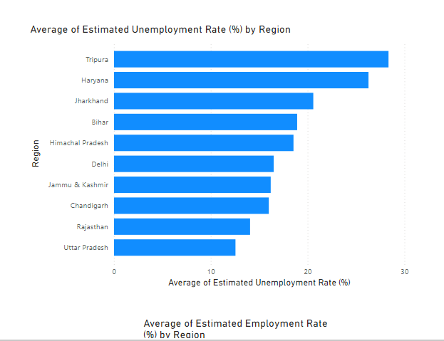

# Unemployment in India (May 2019 - Jun 2020): *Covid-19*

## Introduction
This is an internship task from Cognorise Infotech, I was tasked to analyze this  *Unemployment in India* dataset to uncover meaningful insights and recommend data driven strategies. As a data analyst, this project served as a hands-on opportunity to apply my skills and knowledge in a real-world setting.  The dataset consist of one table and 
**_Disclaimer_**: *This is a dummy dataset used to demonstrate my proficiency of PowerBI and data analytics*

## Problem Statement
1. How did the COVID-19 lockdown impact unemployment trends across different areas and regions in the country?
2. How did the Unemployment increase over time
3. Did it ever reduced or stopped
4. What factors contributed to unemployment
5. Which regions faced the highest unemployment rates during the pandemic, and what structural or economic factors contributed to these disparities?
6. What role did labor force participation play in influencing unemployment trends during the pandemic?
7. How did the resilience of rural economies contribute to lower unemployment rates compared to urban economies during the pandemic?
8. How did pandemic-resilient industries contribute to the rapid decline in unemployment post-lockdown, and what lessons can be learned for future crises?

## Skills demonstrated
The following Power-BI features and soft skills were incorporated:
- Data Analysis Expression (DAX)
- Time series analysis
- Geospatial analysis
- Visualization
- Filters
- Performance optimization
- Story-telling

## Data Sourcing
Data was sourced from Kaggle. Get data here(https://www.kaggle.com/datasets/gokulrajkmv/unemployment-in-india?select=Unemployment+in+India.csv)

## Data Transformation
### Cleaning the data
_In Excel_
1. Removed blank rows
2. Custom columns
   - Estimated Unemployed = $(D2*G2)/(100-D2)$
   - Labour force = $(E2+G2)$
   - Estimated Employed Rate = $(100-D2)$

_In Power BI_

3. Changed the datatype of Estimated Employed Rate from text to decimal numbers
4. Changed the dattype of Date column from date/time to date

## Data Modelling
Added DAX columns
- Month Year = $FORMAT('Unemployment in India2 (2)'[ Date],"mmm, yyyy")$
- Month = $FORMAT('Unemployment in India2 (2)'[ Date],"mmmm")$

## Visualization

### May 2019 to March 2020:
The unemployment rate displayed gentle increases and decreases, reflecting a relatively balanced labor market before the pandemic.

### March 2020 Onward:
Lockdowns caused a sharp surge, creating a steep upward curve as economic activities halted.

### June 2020:
The rate plummeted in a steep downward curve, signaling a recovery phase as restrictions lifted and businesses reopened.

### Regions with High employment rate are: 

### Regions with High Unemployment rate are:

### Summary of Findings

_Note_: The bubbles on the map visual denote regions and their unemployment rate, Green for low and Red for high.

View Interactive Power BI dashboard here(https://app.powerbi.com/view?r=eyJrIjoiY2ViOThiNWItMDczYS00YTU2LTliMjYtMGJkYjEwMThlMGFjIiwidCI6ImRlNGUxNjljLWE3YzYtNGI5NC04OTUyLWJlMjliY2FiZWY1NSJ9)

Total Labour force = 5.91 billion
Total Employed persons = 5.33 billion
Total Unemployed persons = 588.22 million
Average Unemployment rate = 11.79 %
Average Employment rate = 88.21 %
Average Labour participation rate = 42.63 %
Total Regions = 28
Unemployment rate in 2019 = 9.40 %
Unemployment rate in 2029 = 15.20 % 

- Fluctuations Before the Pandemic (May 2019–March 2020):
The unemployment rate experienced a gentle, gradual increase and decrease simultaneously during this period. This fluctuation suggests a stable but dynamic labor market, with variations likely driven by seasonal employment patterns and regional economic activities.

- Sharp Surge Post-March 2020:
Following the COVID-19 lockdowns, unemployment rates spiked sharply, indicating widespread job losses due to restricted economic activities.

- Drastic Decline in June 2020:
A sharp recovery was observed as unemployment dropped significantly from 24.88% in May 2020 to 11.90% in June 2020, driven by the easing of restrictions and businesses adapting to the "new normal."

- Rural-Urban Disparity:
Rural areas consistently had lower unemployment rates compared to urban regions, possibly due to the reliance on agriculture and informal sectors less affected by lockdowns compared to urban-centric industries.

- High Unemployment Regions:
States like Tripura, Haryana, Jharkhand, Bihar, and Himachal Pradesh exhibited higher unemployment, possibly due to a lack of diverse job opportunities and greater dependence on industries heavily impacted by the pandemic.

- High Employment Regions:
States such as Meghalaya, Odisha, Assam, Uttarakhand, Gujarat, and Karnataka, Sikkim, Madhya Pradesh, Andra Pradesh, Maharashtra maintained higher employment rates, benefiting from more resilient economic structures and stronger rural economies.

### Recommendation
1. Encourage growth in industries less vulnerable to disruptions, such as technology, agriculture, and renewable energy, to create stable employment opportunities.

2. Launch employment initiatives in high-unemployment states, focusing on skill development, infrastructure projects, and incentives for business investments.

3. Urban areas should receive targeted aid to revive industries like manufacturing, tourism, and retail, which faced the most significant impacts from lockdowns.

4. Build on rural employment resilience by expanding agro-based industries and promoting entrepreneurship in small-scale businesses.
