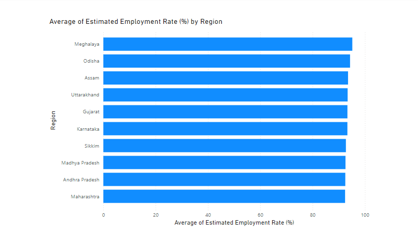
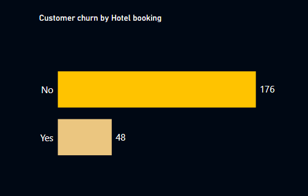

## Project 1
# Unemployment in India (May 2019 - Jun 2020): *Covid-19*

## Introduction
This is an internship task from Cognorise Infotech, I was tasked to analyze this  *Unemployment in India* dataset to uncover meaningful insights and recommend data driven strategies. As a data analyst, this project served as a hands-on opportunity to apply my skills and knowledge in a real-world setting.  The dataset consist of one table and 7 columns.
**_Disclaimer_**: *This is a dummy dataset used to demonstrate my proficiency of PowerBI and data analytics*

## Problem Statement
1. How did the COVID-19 lockdown impact unemployment trends across different areas and regions in the country?
2. How did the Unemployment increase over time
3. Did it ever reduced or stopped
4. What factors contributed to unemployment
5. Which regions faced the highest unemployment rates during the pandemic, and what structural or economic factors contributed to these disparities?
6. What role did labor force participation play in influencing unemployment trends during the pandemic?
7. How did the resilience of rural economies contribute to lower unemployment rates compared to urban economies during the pandemic?
8. How did pandemic-resilient industries contribute to the rapid decline in unemployment post-lockdown, and what lessons can be learned for future crises?

## Skills demonstrated
The following Power-BI features and soft skills were incorporated:
- Data Analysis Expression (DAX)
- Time series analysis
- Geospatial analysis
- Visualization
- Filters
- Performance optimization
- Story-telling

## Data Sourcing
Data was sourced from Kaggle. Get data here(https://www.kaggle.com/datasets/gokulrajkmv/unemployment-in-india?select=Unemployment+in+India.csv)

## Data Transformation
### Cleaning the data
_In Excel_
1. Removed blank rows
2. Custom columns
   - Estimated Unemployed = $(D2*G2)/(100-D2)$
   - Labour force = $(E2+G2)$
   - Estimated Employed Rate = $(100-D2)$

_In Power BI_

3. Changed the datatype of Estimated Employed Rate from text to decimal numbers
4. Changed the dattype of Date column from date/time to date

## Data Modelling
Added DAX columns
- Month Year = $FORMAT('Unemployment in India2 (2)'[ Date],"mmm, yyyy")$
- Month = $FORMAT('Unemployment in India2 (2)'[ Date],"mmmm")$

## Visualization

### May 2019 to March 2020:
The unemployment rate displayed gentle increases and decreases, reflecting a relatively balanced labor market before the pandemic.

### March 2020 Onward:
Lockdowns caused a sharp surge, creating a steep upward curve as economic activities halted.

### June 2020:
The rate plummeted in a steep downward curve, signaling a recovery phase as restrictions lifted and businesses reopened.

### Regions with High employment rate are: 

### Regions with High Unemployment rate are:

### Summary of Findings

_Note_: The bubbles on the map visual denote regions and their unemployment rate, Green for low and Red for high.

View Interactive Power BI dashboard here(https://app.powerbi.com/view?r=eyJrIjoiY2ViOThiNWItMDczYS00YTU2LTliMjYtMGJkYjEwMThlMGFjIiwidCI6ImRlNGUxNjljLWE3YzYtNGI5NC04OTUyLWJlMjliY2FiZWY1NSJ9)

Total Labour force = 5.91 billion
Total Employed persons = 5.33 billion
Total Unemployed persons = 588.22 million
Average Unemployment rate = 11.79 %
Average Employment rate = 88.21 %
Average Labour participation rate = 42.63 %
Total Regions = 28
Unemployment rate in 2019 = 9.40 %
Unemployment rate in 2020 = 15.20 % 

- Fluctuations Before the Pandemic (May 2019–March 2020):
The unemployment rate experienced a gentle, gradual increase and decrease simultaneously during this period. This fluctuation suggests a stable but dynamic labor market, with variations likely driven by seasonal employment patterns and regional economic activities.

- Sharp Surge Post-March 2020:
Following the COVID-19 lockdowns, unemployment rates spiked sharply, indicating widespread job losses due to restricted economic activities.

- Drastic Decline in June 2020:
A sharp recovery was observed as unemployment dropped significantly from 24.88% in May 2020 to 11.90% in June 2020, driven by the easing of restrictions and businesses adapting to the "new normal."

- Rural-Urban Disparity:
Rural areas consistently had lower unemployment rates compared to urban regions, possibly due to the reliance on agriculture and informal sectors less affected by lockdowns compared to urban-centric industries.

- High Unemployment Regions:
States like Tripura, Haryana, Jharkhand, Bihar, and Himachal Pradesh exhibited higher unemployment, possibly due to a lack of diverse job opportunities and greater dependence on industries heavily impacted by the pandemic.

- High Employment Regions:
States such as Meghalaya, Odisha, Assam, Uttarakhand, Gujarat, and Karnataka, Sikkim, Madhya Pradesh, Andra Pradesh, Maharashtra maintained higher employment rates, benefiting from more resilient economic structures and stronger rural economies.

### Recommendation
1. Encourage growth in industries less vulnerable to disruptions, such as technology, agriculture, and renewable energy, to create stable employment opportunities.

2. Launch employment initiatives in high-unemployment states, focusing on skill development, infrastructure projects, and incentives for business investments.

3. Urban areas should receive targeted aid to revive industries like manufacturing, tourism, and retail, which faced the most significant impacts from lockdowns.

4. Build on rural employment resilience by expanding agro-based industries and promoting entrepreneurship in small-scale businesses.

## Project 2
# Tour and Travel Customer Churn Analysis

## Introduction
This is an internship task from Cognorise Infotech, I was tasked to analyze this *Tour and travel customer churn* dataset to uncover meaningful insights and recommend data driven strategies. As a data analyst, this project served as a hands-on opportunity to apply my skills and knowledge in a real-world setting. The dataset consist of one table and 7 columns.  **_Disclaimer_**: This is a dummy dataset used to demonstrate my proficiency of PowerBI and data analytics

## Problem statement
Analyze which of the customers churn and recommend ways to save the company money

## Skills demonstrated:
- Exploratory Data Analysis
- Data Visualization
- Filter
- Critical-thinking
- Problem solving
- Story_telling

## Tools used:
Power BI

## Analysis and Visualization
The report contains and visualizes 6 key insights:
- Customer churn by age
- Customer churn by Company account sync
- Customer churn by Hotel booking
- Customer churn by Annual income class
- Customer churn by Services opted

### Customer churn by age

The age range of customers is between 27 and 38 years, with 28, 27, 30, 37 and 34 arranged in descending order according to number of churn being the most represented ages among churned customers. Also 33 years old customers churned low.

### Customer churn by Company account sync

Customers who did not link their social media accounts to the company account have churned more (125 vs 99).

### Customer churn by Hotel booking

Customers who did not book hotels have churned more (176 vs 48).

### Customer churn by Annual income class

Customers with low and high incomes have churned more.

### Customer churn by Services opted

Customers who opted for 1, 2, and 5 services have churned more.

### Tour and travel Customer churn analysis Dashboard

View an interactive Power BI dashboard here(https://app.powerbi.com/view?r=eyJrIjoiYWNiOTQwZWMtYjVjNC00YWI4LWExZmMtM2I2MjdhMTJiZWIzIiwidCI6ImRlNGUxNjljLWE3YzYtNGI5NC04OTUyLWJlMjliY2FiZWY1NSJ9)

## Summary of Key Findings
1. Out of a total of 954 customers, 23.48% (224 customers) have churned. This indicates a significant portion of customers are leaving, highlighting the need for strategies to improve retention.

2. The age range of customers spans from 27 to 38 years. Among those who churned, the most frequently represented ages are 27, 28, 30, 34, and 37. This suggests these age groups might have unique needs or face challenges that are not being adequately addressed.

3. Customers with both low and high income levels appear to churn more frequently than those with moderate incomes. This indicates a potential gap in tailored offerings that appeal to these income groups.

4. Customers who have not linked their social media accounts to the company account are more likely to churn (125 customers) compared to those who have linked their accounts (99 customers). This suggests a missed opportunity for deeper engagement with these customers.

5. A significant number of churned customers (176) did not book hotels through the company, while only 48 churned customers had used the hotel booking service. This suggests that customers who do not engage with this service are at a higher risk of leaving.

6. Customers who opted for either 1, 2, or 5 services showed higher churn rates compared to those using other service combinations. This could indicate dissatisfaction or a lack of perceived value in these specific service offerings.

## Predictions
1. Demographic Trends: Without intervention, churn will likely remain higher among customers aged 27–38 due to their significant representation.

2. Behavioral Impact: Customers who fail to engage with social media or hotel services are more likely to churn, so targeting these areas is critical.

3. Service Preferences: A significant portion of customers opting for minimal or specific services will continue to churn unless the offerings are restructured to meet their expectations.

4. Income Sensitivity: The trend of higher churn among low and high-income groups may persist, highlighting the need for income-based personalization.

## Recommendations
1. Since the most represented ages among churned customers are 27, 28, 30, 34, and 37, consider tailoring offers, discounts, or exclusive packages for these age groups to enhance engagement and satisfaction.

2. Develop targeted campaigns for low and high-income customers. For lower-income customers, introduce budget-friendly travel packages or flexible payment plans. For high-income customers, promote premium experiences, exclusive deals, or loyalty programs to increase their value perception.

3. Encourage customers to link their social media accounts by offering incentives like loyalty points, personalized travel recommendations, or access to exclusive deals. Highlight the benefits of social media integration to build stronger relationships with customers.

4. Promote Hotel Booking Services:
Highlight the convenience and value of booking hotels through the company. Offer bundled deals combining tours and accommodations or provide special rates for loyal customers who book both.

5. Analyze why customers opting for 1, 2, and 5 services are more likely to churn. Enhance the appeal of these service packages by bundling them with complementary offers or upgrading them to include additional perks, making them more attractive.

6. Regularly gather feedback from customers who are not actively using certain services or are on the verge of churning. Use this feedback to improve offerings and address their specific pain points.

## Project 3

# Employee Salaries

## Introduction
This is an internship task from Cognorise Infotech, I was tasked to analyze this  *Employee Salaries* dataset to uncover meaningful insights and recommend data driven strategies. As a data analyst, this project served as a hands-on opportunity to apply my skills and knowledge in a real-world setting.  The dataset consist of one table and 12 columns.
**_Disclaimer_**: *This is a dummy dataset used to demonstrate my proficiency in data analytics*

## Problem statement
The company seeks to better understand its employee salary structure, analyze trends across different roles, locations, and employment types, and identify opportunities to optimize compensation strategies. Key insights into the distribution of salaries, variations by company size, employee type, experience level, and geographic region are critical for aligning salary policies with organizational goals and market standards.

## Skills demonstrated:
- Data cleaning
- Visualization
- Filter
- Story telling
- Problem solving

## Data Sourcing
Data was sourced from Kaggle. Get data here(https://www.kaggle.com/datasets/inductiveanks/employee-salaries-for-different-job-roles)

## Visualization

View an interactive dashboard here(https://app.powerbi.com/view?r=eyJrIjoiYzBiZjE2YjMtYzBmNy00MGQzLThiNTUtNmRlNzViMGEyNmRjIiwidCI6ImRlNGUxNjljLWE3YzYtNGI5NC04OTUyLWJlMjliY2FiZWY1NSJ9)

## Key Findings
1. Overall Dataset Overview:
The dataset covers salary data from 2020 to 2022, with a total salary expenditure of $68.16 million for 607 employees across 50 countries. Employees span 50 job titles, 17 salary currencies, and 4 employment types.

2. Top 10 Highest Paid Job Titles:
Leadership and specialized roles in data analytics, engineering, and science dominate the top 10 highest-paid positions.
Examples include Data Analytics Lead, Principal Data Engineer, and Director of Data Science.

3. Average Salary by Company Size:
Large companies offer the highest average salaries, followed by medium-sized companies. Small companies provide the lowest average salaries.

4. Average Salary by Employment Type:
Contract roles command the highest average salary ($185,000), followed by full-time jobs ($113,000). Freelance and part-time roles have the lowest compensation.

5. Average Salary by Experience Level:
Executive-level employees earn the highest average salaries, followed by senior and middle-level employees. Entry-level roles have the lowest salaries.

6. Top Paying Countries:
Russia, the United States, and Israel are the top three highest-paying countries, indicating regional disparities in compensation.

## Recommendation
Ensure competitive pay for high-impact roles like Data Analytics Lead and Principal Data Scientist. Offer attractive packages to retain high-earning contract employees. Study high-paying countries like Russia, the US, and Israel to improve salary strategies. Provide perks and growth opportunities for entry-level and part-time employees. Address salary gaps in smaller organizations with additional benefits or bonuses. These actions will improve retention and maintain a competitive workforce.

